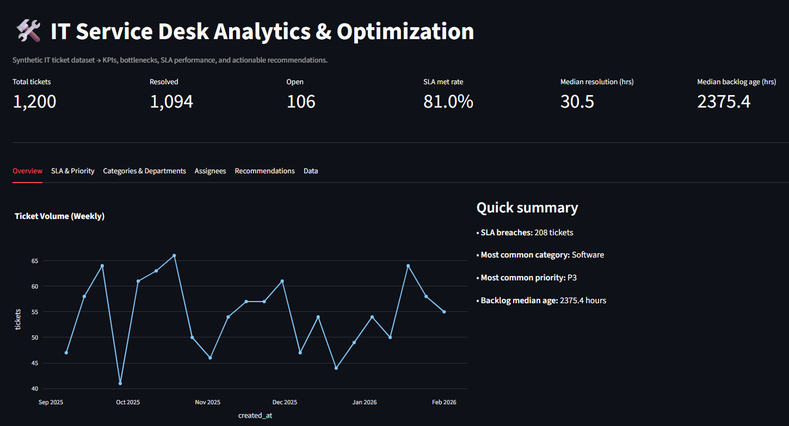
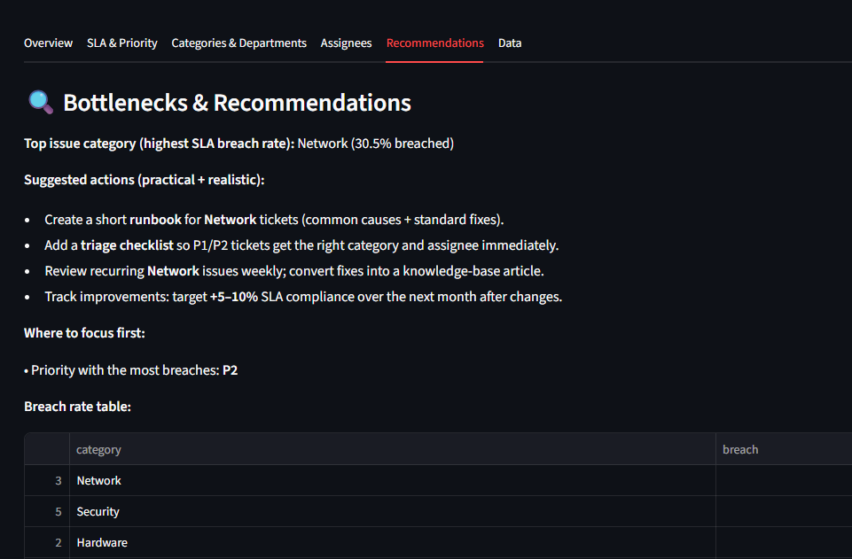

# 🛠️ IT Service Desk Analytics & Optimization Dashboard

An interactive analytics dashboard built with **Streamlit, pandas, and Plotly** to simulate how IT operations teams monitor ticket performance, SLA compliance, and operational bottlenecks.

This project analyzes synthetic IT service desk ticket data to identify inefficiencies and generate actionable process recommendations.

---

## 🚀 Live Demo
(Add your Streamlit deployment link here once deployed)

---

## 📊 Project Overview

IT service teams rely on Service Level Agreements (SLAs) and ticket metrics to maintain operational efficiency.  
This dashboard simulates a real-world IT ticket dataset and provides:

- KPI tracking (volume, SLA compliance, backlog)
- Priority-level SLA analysis
- Category-based bottleneck detection
- Assignee workload insights
- Actionable process improvement recommendations

The goal is not just visualization — but **operational insight generation**.

---

## 📈 Key Features

### 1️⃣ Executive KPI Overview
- Total tickets
- Open vs resolved
- SLA compliance rate
- Median resolution time
- Median backlog age

### 2️⃣ SLA & Priority Analysis
- SLA compliance by priority
- Breach rate by category
- Identification of high-risk ticket types

### 3️⃣ Operational Bottleneck Detection
- Weekly ticket volume trends
- Department-level resolution performance
- Assignee workload vs resolution time analysis

### 4️⃣ Automated Recommendations
- Identifies category with highest SLA breach rate
- Suggests runbooks, triage improvements, and knowledge-base creation
- Recommends SLA improvement targets (+5–10%)

---

## 🧠 Example Insights (from dataset)

- SLA compliance: **81%**
- Highest breach category: **Network (30.5%)**
- Most breach-prone priority: **P2**
- Median backlog age: **2375 hours**

This simulates how an IT operations team could prioritize process improvements.

---

## 🛠️ Tech Stack

- Python
- pandas
- Streamlit
- Plotly
- NumPy (synthetic data generation)

---

## 📁 Project Structure

```
it-service-desk-dashboard/
│
├── app.py
├── requirements.txt
├── README.md
├── data/
│   └── tickets.csv
└── scripts/
    └── generate_data.py
```

---

## ▶️ How to Run Locally

1. Clone the repository

2. Install dependencies:

```bash
pip install -r requirements.txt
```

3. Generate the dataset:

```bash
python scripts/generate_data.py
```

4. Run the Streamlit app:

```bash
streamlit run app.py
```

---

## 📸 Screenshots

(Add your screenshots inside an `assets/` folder and name them as shown below.)

### Overview Dashboard


### Bottlenecks & Recommendations


---

## 📌 Why I Built This

I enjoy analyzing operational patterns and identifying structured improvements.  
This project combines:

- Data analysis  
- KPI monitoring  
- Process thinking  
- Strategic planning  

It reflects my interest in **data analytics, IT operations, and process optimization roles**.

---

## 🔮 Future Improvements

- Connect to a real SQL database instead of CSV
- Add role-based access controls
- Implement ticket forecasting model
- Track SLA improvement over time after process changes
- Deploy with Docker + CI/CD pipeline

---

## 📬 Contact

Keni Sackey  
Computer Science (Data Science minor)  
LinkedIn: https://www.linkedin.com/in/keni-sackey-9792141b0/  
Portfolio: https://kats-19.github.io/Keni-Sackey-portfolio/
